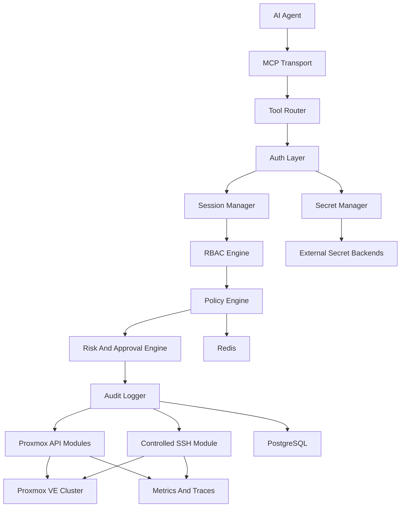
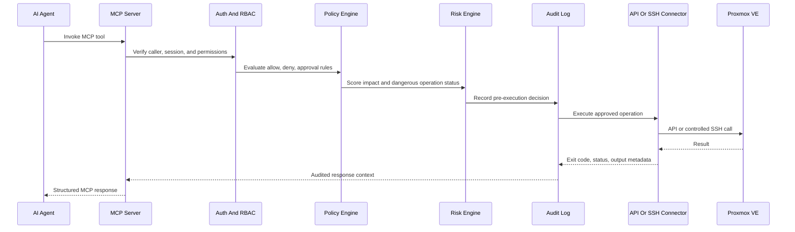
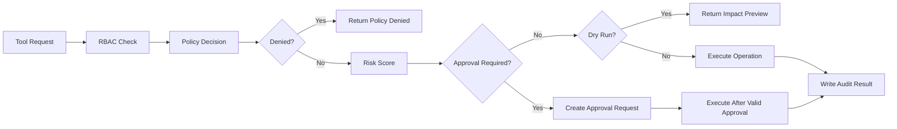
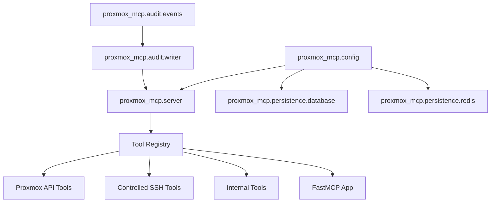

# Enterprise Proxmox MCP Server

[](https://github.com/0x696E7175696C696E65/Proxmox-MCP/actions/workflows/ci.yml)


Enterprise Proxmox MCP is a security-first Model Context Protocol server for AI-assisted Proxmox VE administration. It gives agents a controlled way to inspect and operate Proxmox through API and SSH paths while preserving authentication, RBAC, policy enforcement, approvals, audit trails, and operational safeguards.

This is not a thin Proxmox wrapper and it is not marketed as finished enterprise GA software. It is an actively developed, evidence-backed public preview for homelabs, research environments, MSP evaluation, datacenter automation experiments, and advanced AI operations where safety controls matter as much as tool coverage.

If you are evaluating the project as an end user, treat it as a controlled automation gateway:

- Start with read-only discovery tools.
- Use dry-run responses and impact previews before mutation.
- Keep dangerous operations approval-gated.
- Run disposable lab validation before connecting to important infrastructure.
- Promote capabilities only when your own topology has matching evidence.

## What This Project Enables

- AI-native administration for Proxmox clusters, nodes, VMs, LXC containers, storage, networking, firewalls, backups, HA, Ceph, users, and permissions.
- ISO, LXC template, and setup workflow helpers for common VM/LXC provisioning paths.
- Community Proxmox helper-script discovery, preview, staging, and guarded execution using the upstream `community-scripts/ProxmoxVE` repository with the project owner's fork as a fallback source.
- Controlled SSH operations for diagnostics, file transfer, interactive sessions, and shell workflows that are not fully covered by the Proxmox API.
- Configurable dangerous-operation support with dry runs, risk scoring, impact analysis, approvals, target revalidation, and audit evidence.
- Enterprise observability through structured logs, audit events, Prometheus metrics, OpenTelemetry traces, and SIEM-ready event streams.
- Secret-provider integration through development, HashiCorp Vault KV v2, Bitwarden-style item fields, 1Password-style item fields, AWS Secrets Manager JSON secrets, and Azure Key Vault JSON secrets.

## Current Status

The project is currently an evidence-backed public preview. The control plane, registered tool catalog, security model, deployment scaffolding, and lab validation harness are implemented on `main`. Broader enterprise readiness still depends on topology-specific qualification, production deployment proof, and backend-specific promotion of guarded operations.

The release posture is intentionally conservative: the README and docs should describe only what deterministic tests, registered MCP-path checks, opt-in lab gates, and sanitized release evidence support.

Implemented:

- FastMCP server factory with registry-driven tool registration.
- Standard MCP request, response, error, dry-run, impact, approval, and audit envelopes.
- Authentication models, service-token authentication, OIDC RS256/JWKS validation, mTLS client-certificate identity mapping, signed workload identity validation, RBAC evaluation, policy decisions, risk scoring, and approval validation.
- Durable audit persistence with SQLAlchemy models and Alembic migration.
- Secret-provider abstraction with development, Vault, Bitwarden, 1Password, AWS Secrets Manager, and Azure Key Vault adapters.
- Proxmox cluster credential resolution, in-memory Proxmox API test client, and token/password-auth Proxmox lab HTTP adapter.
- Read-only Proxmox tools, safe mutations, dangerous operations, promoted domain-pack tools, and SSH tools.
- Native media/template tools for ISO listing, HTTPS ISO download, VM ISO attachment, LXC template listing/download, and VM/LXC setup workflow previews.
- Helper-script catalog, preview, staging, and execution tools with source allowlisting, commit pinning, SHA-256 hashing, fallback-source logging, and approval-gated SSH execution.
- Controlled SSH execution, command policy, session tracking, SFTP/SCP operations, and output redaction.
- Runtime observability wiring for Prometheus-style metrics, structured JSON logs, trace context, audit correlation, Alertmanager-backed recent alerts, Prometheus-backed resource trends, and SIEM/Loki payloads.
- Durable shared-state foundations for approvals, idempotency, SSH sessions, SSH recordings, Proxmox task state, and SIEM retry/dead-letter delivery.
- Reliability primitives for retries, circuit breakers, idempotency, and resumable Proxmox task references.
- Docker, Docker Compose, Kubernetes, Grafana dashboard, hardening workflow, and release hardening runbook.
- Contract tests that verify the registered tool catalog against [`docs/tool-specification.md`](docs/tool-specification.md).
- Profile-driven lab gates for single-node, storage, LXC-template, Ceph, HA, multi-node, and PBS validation tracks.
- Production readiness checks that fail closed for development auth, missing external auth integration, development secret providers, plaintext dependency URLs, and incomplete TLS configuration.

Evidence-backed status:

- **Preview validated:** core MCP control plane, auth/RBAC/policy/approval/audit flows, read-only Proxmox discovery, safe mutations, dangerous-operation guardrails, controlled SSH, durable state, release evidence validation, and the current Proxmox VE 9.1.1 single-node storage lab profile.
- **Lab qualified in the current disposable profile:** `pve-9-storage-local-local-lvm` on Proxmox VE 9.1.1 recorded `20 passed, 8 skipped` with disposable VM lifecycle, registered VM update, backup create/list, restore-precondition dry-run, bounded storage benchmark preview, and read-only node update preflight evidence.
- **Profile-gated:** LXC lifecycle with templates, Ceph, HA, multi-node, PBS availability, backup verification, live storage expansion, and live node update orchestration.
- **Newly guarded:** helper-script execution is available as a first-class tool path, but broad production use requires operator policy, explicit SSH command allowance for the helper runner, and disposable lab evidence for the scripts being used.
- **Operator-qualified:** production deployment depends on environment-specific external auth, enterprise secret backend, TLS material, PostgreSQL TLS, Redis TLS, least-privilege Proxmox credentials, and release evidence for the enabled topology.

Validation at merge time:

- `python -m ruff format .`
- `python -m ruff check .`
- `python -m pyright`
- `python -m pytest`
- Distribution readiness workflow: builds and validates Python sdist/wheel artifacts, smoke-installs the wheel, audits dependencies, and builds the Docker image.
- Dedicated security invariant suite covering fail-closed guard behavior, approval replay protection, audit evidence, redaction boundaries, and encrypted transport enforcement.
- Current local and lab verification should be rerun before each release candidate; the latest run reported `397 passed, 9 skipped`, including the gated disposable lab profile that was enabled for qualification.
- Release evidence validation now schema-checks compatibility profiles, release summary fields, lab artifacts, artifact hashes, required profile tests, tool promotion evidence, and credential-shaped key rejection.
- Live disposable Proxmox VE 9.1.1 lab evidence currently covers the `pve-9-storage-local-local-lvm` preview profile. Ceph, HA, multi-node, PBS verification, LXC lifecycle without a template, live storage expansion, and live node updates remain unqualified in this lab.
- MCP communication audit: local runtime test negotiated `TLSv1.3` with `TLS_AES_256_GCM_SHA384`, FastMCP client access succeeded over HTTPS, and plaintext HTTP to the MCP port returned no response bytes.
- Network transport policy: MCP ingress is HTTPS-only, Proxmox API endpoints require `https://`, PostgreSQL must request TLS, Redis must use `rediss://`, and SSH remains encrypted by protocol.

Important caveat: the codebase is preview-ready for development and lab validation, not certified for unattended production control of real Proxmox clusters. Ambiguous or backend-specific operations, such as generic storage expansion, backup verification, and node update orchestration, remain guarded with `NOT_IMPLEMENTED` until they have exact contracts, lab evidence, and release gates. Bounded storage benchmarking is supported only through the controlled domain-tool path and should not be treated as a broad storage-backend guarantee. External observability tools return `external_source_required` unless Alertmanager or Prometheus backends are configured. Multi-replica deployment claims have durable foundations, but still require operator configuration and release evidence before qualification. Enterprise auth primitives are wired through a server `authenticated_session_resolver` hook; production gateways must supply verified sessions and use the Redis-backed replay cache for workload identities.

## Architecture



Every tool call is expected to pass through a consistent control plane before it can touch Proxmox:



## Safety Model

Dangerous operations are supported, but they are never treated as ordinary tool calls.



The security model is built around these invariants:

- Deny policies always override allow policies.
- SSH access is separate from Proxmox API access.
- Secrets are referenced through secret backends and never returned through MCP tools.
- Mutating actions require audit evidence before and after execution.
- Destructive actions can be enabled, denied, or approval-gated by environment.
- Dry-run and impact-analysis paths are first-class behavior, not UI-only features.

## Tool Coverage

The MCP catalog in [`docs/tool-specification.md`](docs/tool-specification.md) is registered and contract-tested across these domains:

- Cluster status, membership, quorum, replication, and tasks
- Node services, packages, hardware, logs, power, and networking
- VM create, clone, lifecycle, migration, snapshots, restore, and hardware changes
- LXC create, clone, lifecycle, snapshots, restore, and resource changes
- Storage management for ZFS, LVM, LVM-thin, NFS, SMB, Ceph, and directory storage
- Bridges, bonds, VLANs, SDN, VXLAN, and Linux network validation
- Datacenter, node, and guest firewall rules, aliases, and IP sets
- Backups, restores, verification, retention, and scheduled jobs
- Ceph pools, OSDs, MONs, MGRs, health, and rebalancing
- HA resources and groups
- Users, groups, roles, and permissions
- Monitoring, diagnostics, support bundles, SMART, ZFS, and Ceph metrics
- Controlled SSH command execution, interactive sessions, SFTP, SCP, upload, and download

Tool implementation tiers:

- **Implemented read paths:** inventory, configuration, status, metrics, logs, Ceph, HA, users, permissions, storage, networking, firewall, and backup discovery tools backed by Proxmox API paths.
- **Implemented domain pack paths:** VM/LXC lifecycle and restore, storage/ZFS/LVM/disk, network/firewall, backup/retention, Ceph/HA, SSH console/diagnostics, and support bundle operations with pack-specific contract tests.
- **Implemented safe mutation paths:** VM/LXC lifecycle operations, snapshots, backups, and non-destructive config updates with dry-run behavior and impact metadata.
- **Implemented dangerous paths:** destructive VM/LXC/storage/Ceph/user/networking operations with critical/high risk metadata, approval defaults, target revalidation where applicable, and audit metadata.
- **Implemented SSH paths:** command execution, policy denial, session open/close, interactive execution contract, durable LXC console session references, SFTP/SCP file flows, recording references, and redaction.
- **Guarded placeholders:** tools whose safe live behavior is backend-specific or not yet backed by a concrete operation fail visibly with `NOT_IMPLEMENTED` instead of returning placeholder success.

Operational references:

- [`docs/testing-strategy.md`](docs/testing-strategy.md) describes the skip-safe Proxmox lab harness.
- [`docs/tool-promotion-framework.md`](docs/tool-promotion-framework.md) defines promotion criteria for guarded tools.
- [`docs/domain-pack-status.md`](docs/domain-pack-status.md) records domain-pack support, validation, and safety notes.

## Public Preview Checklist

Before cutting or sharing a preview release, attach evidence for:

- CI, distribution, hardening, migration, SBOM, and Trivy gates.
- `docs/release-evidence/compatibility-report.example.json`, `docs/release-evidence/lab-evidence.example.json`, and generated artifact-manifest schema/hash validation.
- The exact Proxmox lab profile being claimed in [`docs/proxmox-compatibility.md`](docs/proxmox-compatibility.md).
- Guarded-tool status for `verify_backup`, `expand_storage`, and node update orchestration.
- Bounded benchmark evidence for `benchmark_storage`, including runtime/size caps, `mcp-lab-*` artifact paths, and cleanup proof.
- Production configuration review covering TLS, external auth, secret backend, PostgreSQL TLS, Redis TLS, and operator-provided credentials.

## Runtime Modules

The runtime is organized around a shared tool registry and execution context:



## Quick Start

Use this path to evaluate the project locally and understand the safety model before connecting it to a Proxmox host.

Clone the repository:

```powershell
git clone https://github.com/0x696E7175696C696E65/Proxmox-MCP.git
cd Proxmox-MCP
```

Create an environment and install the package with development dependencies:

```powershell
python -m venv .venv
.\.venv\Scripts\Activate.ps1
python -m pip install -e ".[dev]"
```

Run the local verification suite:

```powershell
python -m ruff format --check .
python -m ruff check .
python -m pyright
python -m pytest -q
```

Print the package version:

```powershell
python -m proxmox_mcp --version
```

For live Proxmox evaluation, start with a disposable or non-critical lab host. Configure credentials through environment variables or an ignored local env file only. Do not paste real credentials into prompts, commits, screenshots, or generated release evidence.

Run the lab preflight before enabling mutation gates:

```powershell
$env:PROXMOX_MCP_LAB_ENABLED = "true"
$env:PROXMOX_MCP_LAB_API_ENDPOINT = "https://pve.example.test:8006"
$env:PROXMOX_MCP_LAB_USERNAME = "root@pam"
$env:PROXMOX_MCP_LAB_PASSWORD = "<load-from-local-secret>"
$env:PROXMOX_MCP_LAB_NODE = "pve"
$env:PROXMOX_MCP_LAB_STORAGE = "local"
python scripts/lab_preflight.py --output-file release-evidence/lab-preflight.json
```

Then run read-only lab tests:

```powershell
python -m pytest tests/lab -m lab -q
```

Only enable disposable mutation tests after preflight succeeds and after you choose explicit throwaway IDs:

```powershell
$env:PROXMOX_MCP_LAB_MUTATIONS_ENABLED = "true"
$env:PROXMOX_MCP_LAB_DESTRUCTIVE_ENABLED = "true"
$env:PROXMOX_MCP_LAB_TEST_VMID = "9101"
$env:PROXMOX_MCP_LAB_TEST_CTID = "9102"
python -m pytest tests/lab -m lab --junitxml=release-evidence/lab-junit.xml -q
```

## Configuration

Runtime settings are environment driven and use the `PROXMOX_MCP_` prefix.

```powershell
$env:PROXMOX_MCP_ENVIRONMENT = "development"
$env:PROXMOX_MCP_SERVER_HOST = "127.0.0.1"
$env:PROXMOX_MCP_SERVER_PORT = "8443"
$env:PROXMOX_MCP_DATABASE_URL = "postgresql+asyncpg://app_user:<load-from-secret>@postgres/proxmox_mcp?ssl=require"
$env:PROXMOX_MCP_REDIS_URL = "rediss://redis:6379/0"
$env:PROXMOX_MCP_DANGEROUS_OPERATIONS__REQUIRE_APPROVAL = "true"
```

Secret-like settings are modeled with Pydantic `SecretStr` and are redacted by safe serialization helpers.
Database and Redis settings are TLS-enforced: PostgreSQL must request TLS and Redis must use `rediss://`.

Secret backends are selected with `PROXMOX_MCP_CREDENTIAL_PROVIDER`. Supported values are `development`, `hashicorp_vault`, `bitwarden`, `onepassword`, `aws_secrets_manager`, and `azure_key_vault`. Use the `development` provider only for local development. External backend URLs such as `PROXMOX_MCP_VAULT_URL` and `PROXMOX_MCP_AZURE_KEY_VAULT_URL` must use `https://`; readiness fails closed when the selected provider is missing required bootstrap configuration.

```powershell
$env:PROXMOX_MCP_CREDENTIAL_PROVIDER = "hashicorp_vault"
$env:PROXMOX_MCP_VAULT_URL = "https://vault.example.com"
$env:PROXMOX_MCP_VAULT_TOKEN = "<load-from-orchestrator-secret>"
```

The MCP server is HTTPS-only. Provide a certificate and key for managed environments:

```powershell
$env:PROXMOX_MCP_TLS__CERT_FILE = "C:\certs\proxmox-mcp\tls.crt"
$env:PROXMOX_MCP_TLS__KEY_FILE = "C:\certs\proxmox-mcp\tls.key"
$env:PROXMOX_MCP_TLS__GENERATE_SELF_SIGNED = "false"
```

For disposable development or lab runs, self-signed certificates can be generated automatically:

```powershell
$env:PROXMOX_MCP_TLS__GENERATE_SELF_SIGNED = "true"
$env:PROXMOX_MCP_TLS__GENERATED_CERT_DIR = "$env:TEMP\proxmox-mcp\certs"
$env:PROXMOX_MCP_TLS__COMMON_NAME = "localhost"
$env:PROXMOX_MCP_TLS__SUBJECT_ALT_NAMES = '["localhost","127.0.0.1"]'
```

Clients must trust the configured certificate or the generated self-signed certificate before connecting.

### Production Configuration Expectations

Production deployments should provide:

- External authentication through the server session resolver, OIDC, mTLS, or signed workload identity integration.
- Redis-backed workload identity replay protection.
- PostgreSQL and Redis with TLS enabled.
- An enterprise secret provider instead of local development secrets.
- Least-privilege Proxmox API credentials scoped to the intended cluster and role.
- Pinned SSH host keys when SSH tools are enabled.
- Approval policy for destructive and high-risk operations.
- Release evidence for the exact Proxmox topology being claimed.

## Technology Stack

- Python 3.13+
- FastMCP
- Pydantic v2 and pydantic-settings
- SQLAlchemy async and asyncpg
- Redis asyncio client
- AsyncSSH
- cryptography
- structlog
- Alembic
- pytest and pytest-asyncio
- Ruff
- Pyright

The current Proxmox and SSH clients include in-memory implementations for deterministic tests. Production adapters should be configured and validated against lab infrastructure before use.

## Roadmap Status


The detailed implementation roadmap lives in [`docs/roadmap.md`](docs/roadmap.md). The preview implementation now covers the planned runtime, security, Proxmox tool, SSH, dangerous-operation, observability, deployment, hardening, and validation-expansion milestones at code and test level. The next phase is collecting additional topology evidence for Ceph, HA, multi-node, PBS verification, LXC templates, node update orchestration, and backend-specific storage expansion before any broader qualification claims.

## Documentation

- [`docs/architecture.md`](docs/architecture.md): system architecture, module boundaries, and runtime flows.
- [`docs/security-model.md`](docs/security-model.md): authentication, authorization, policy, approvals, and dangerous operations.
- [`docs/threat-model.md`](docs/threat-model.md): assets, trust boundaries, abuse cases, and mitigations.
- [`docs/tool-specification.md`](docs/tool-specification.md): 215-tool MCP catalog.
- [`docs/mcp-schema.md`](docs/mcp-schema.md): request, response, error, dry-run, impact, and audit schemas.
- [`docs/database-schema.md`](docs/database-schema.md): persistence model for sessions, policy, audit, approvals, credentials, resources, and SSH recordings.
- [`docs/testing-strategy.md`](docs/testing-strategy.md): unit, integration, security, lab, SSH sandbox, chaos, and acceptance testing.
- [`docs/deployment.md`](docs/deployment.md): Docker, Kubernetes, HA, observability, and operations guidance.
- [`docs/release-hardening.md`](docs/release-hardening.md): preview release gates, chaos scenarios, rollback, and known limitations.
- [`docs/release-candidate-notes.md`](docs/release-candidate-notes.md): release-review categories for preview, profile-gated, operator-qualified, and still-guarded capabilities.
- [`docs/proxmox-compatibility.md`](docs/proxmox-compatibility.md): evidence-backed compatibility profiles and known topology limits.
- [`docs/domain-pack-status.md`](docs/domain-pack-status.md): domain-by-domain tool promotion status and guarded operations.

## License

This project is open source under the Apache License 2.0. You can use, modify, and distribute the source under the terms in [`LICENSE`](LICENSE).

## Production Posture

This project is under active development. The preview implementation includes the enterprise control-plane pieces and current disposable lab evidence, but production use still requires environment-specific validation.

Before connecting to production Proxmox infrastructure:

- Run the full test suite and hardening workflow.
- Validate every enabled mutating or destructive tool against a lab Proxmox cluster.
- Keep `verify_backup`, `expand_storage`, and live node update orchestration disabled unless your environment has matching evidence.
- Configure real PostgreSQL, Redis, Vault or another supported secret backend, and audit retention.
- Review RBAC, policy, approval, and dangerous-operation settings for your tenant model.
- Pin SSH known hosts and validate Proxmox API TLS certificates.
- Confirm backup, rollback, and audit recovery procedures.

Do not enable unattended live mutation or destructive operations until the relevant tools have been verified in your own environment.
