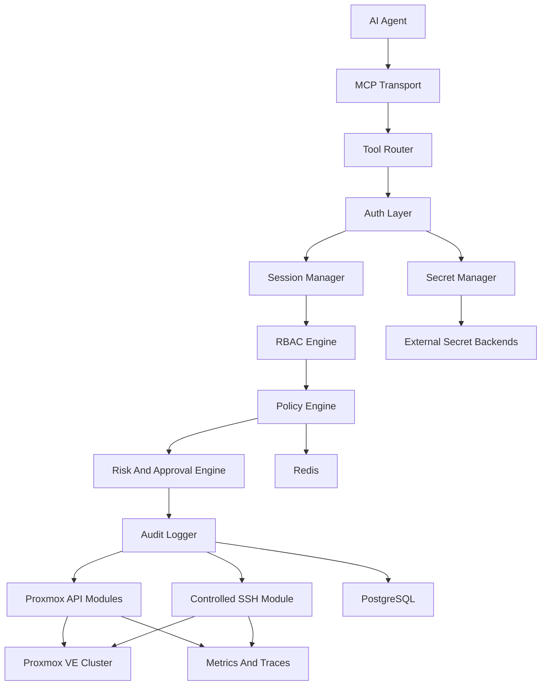
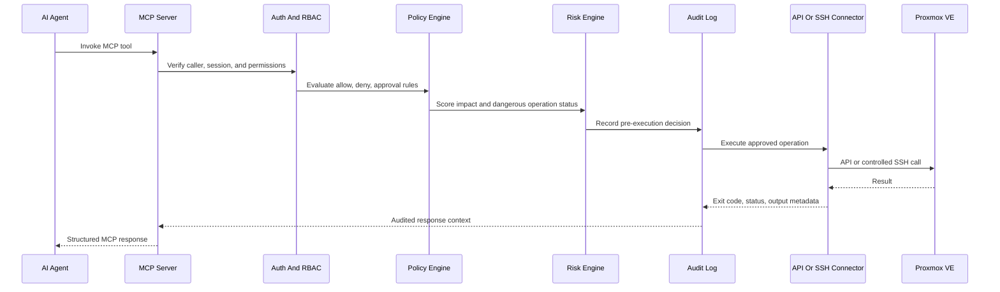
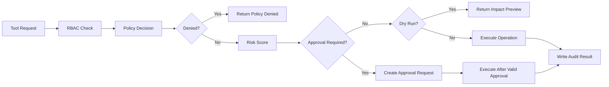
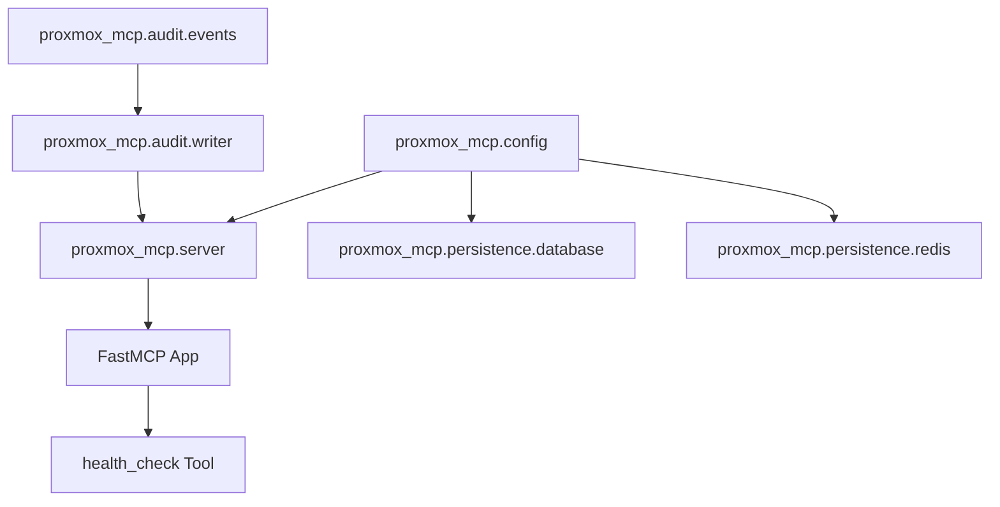

# Enterprise Proxmox MCP Server

[](https://github.com/0x696E7175696C696E65/Proxmox-MCP/actions/workflows/ci.yml)


Enterprise Proxmox MCP is a security-first Model Context Protocol server for AI-assisted Proxmox VE administration. It is designed to let AI agents manage Proxmox infrastructure through controlled API and SSH access while preserving authentication, RBAC, policy enforcement, approval workflows, audit trails, and operational safeguards.

This project is not a thin Proxmox wrapper. It is intended to become an enterprise-grade infrastructure automation platform for homelabs, MSPs, datacenters, research environments, and advanced AI operations.

## What This Project Enables

- AI-native administration for Proxmox clusters, nodes, VMs, LXC containers, storage, networking, firewalls, backups, HA, Ceph, users, and permissions.
- Controlled SSH operations for diagnostics, file transfer, interactive sessions, and shell workflows that are not fully covered by the Proxmox API.
- Configurable dangerous-operation support with dry runs, risk scoring, impact analysis, approvals, target revalidation, and audit evidence.
- Enterprise observability through structured logs, audit events, Prometheus metrics, OpenTelemetry traces, and SIEM-ready event streams.
- Secret-provider integration for Hashicorp Vault, Bitwarden Secrets Manager, 1Password Connect, AWS Secrets Manager, and Azure Key Vault.

## Current Status

The repository currently contains the architecture package plus the first executable runtime foundation:

- Python package scaffold with `pyproject.toml`
- FastMCP server factory
- Audited `health_check` tool
- Typed Pydantic settings with secret redaction
- Audit event models and in-memory audit writer
- SQLAlchemy async engine and Redis client factories
- Unit tests for package, config, audit, persistence, and server behavior
- CI for formatting, linting, type checking, testing, dependency audit, and docs checks

Production Proxmox API, SSH, RBAC, policy, approval, and secret-provider modules are planned in staged milestones. See [`docs/roadmap.md`](docs/roadmap.md).

## Architecture



Every tool call is expected to pass through a consistent control plane before it can touch Proxmox:



## Safety Model

Dangerous operations are supported, but they are never treated as ordinary tool calls.



The security model is built around these invariants:

- Deny policies always override allow policies.
- SSH access is separate from Proxmox API access.
- Secrets are referenced through secret backends and never returned through MCP tools.
- Mutating actions require audit evidence before and after execution.
- Destructive actions can be enabled, denied, or approval-gated by environment.
- Dry-run and impact-analysis paths are first-class behavior, not UI-only features.

## Tool Coverage Plan

The planned MCP surface includes more than 170 tools across these domains:

- Cluster status, membership, quorum, replication, and tasks
- Node services, packages, hardware, logs, power, and networking
- VM create, clone, lifecycle, migration, snapshots, restore, and hardware changes
- LXC create, clone, lifecycle, snapshots, restore, and resource changes
- Storage management for ZFS, LVM, LVM-thin, NFS, SMB, Ceph, and directory storage
- Bridges, bonds, VLANs, SDN, VXLAN, and Linux network validation
- Datacenter, node, and guest firewall rules, aliases, and IP sets
- Backups, restores, verification, retention, and scheduled jobs
- Ceph pools, OSDs, MONs, MGRs, health, and rebalancing
- HA resources and groups
- Users, groups, roles, and permissions
- Monitoring, diagnostics, support bundles, SMART, ZFS, and Ceph metrics
- Controlled SSH command execution, interactive sessions, SFTP, SCP, upload, and download

See [`docs/tool-specification.md`](docs/tool-specification.md) for the full catalog.

## Runtime Foundation

The current codebase implements the foundation needed for later Proxmox modules:



## Quick Start

Clone the repository:

```powershell
git clone https://github.com/0x696E7175696C696E65/Proxmox-MCP.git
cd Proxmox-MCP
```

Install the package with development dependencies:

```powershell
python -m pip install -e ".[dev]"
```

Run the verification suite:

```powershell
python -m ruff format --check .
python -m ruff check .
python -m pyright
python -m pytest -v
```

Print the package version:

```powershell
python -m proxmox_mcp --version
```

## Configuration

Runtime settings are environment driven and use the `PROXMOX_MCP_` prefix.

```powershell
$env:PROXMOX_MCP_ENVIRONMENT = "development"
$env:PROXMOX_MCP_SERVER_HOST = "127.0.0.1"
$env:PROXMOX_MCP_SERVER_PORT = "8080"
$env:PROXMOX_MCP_DANGEROUS_OPERATIONS__REQUIRE_APPROVAL = "true"
```

Secret-like settings are modeled with Pydantic `SecretStr` and are redacted by safe serialization helpers.

## Technology Stack

- Python 3.13+
- FastMCP
- Pydantic v2 and pydantic-settings
- SQLAlchemy async and asyncpg
- Redis asyncio client
- structlog
- pytest and pytest-asyncio
- Ruff
- Pyright

Planned integration modules add AsyncSSH, Proxmoxer, OpenTelemetry, Prometheus, PostgreSQL migrations, secret-provider adapters, and production deployment assets.

## Roadmap


The detailed implementation roadmap lives in [`docs/roadmap.md`](docs/roadmap.md).

## Documentation

- [`docs/architecture.md`](docs/architecture.md): system architecture, module boundaries, and runtime flows.
- [`docs/security-model.md`](docs/security-model.md): authentication, authorization, policy, approvals, and dangerous operations.
- [`docs/threat-model.md`](docs/threat-model.md): assets, trust boundaries, abuse cases, and mitigations.
- [`docs/tool-specification.md`](docs/tool-specification.md): 100+ MCP tool catalog.
- [`docs/mcp-schema.md`](docs/mcp-schema.md): request, response, error, dry-run, impact, and audit schemas.
- [`docs/database-schema.md`](docs/database-schema.md): persistence model for sessions, policy, audit, approvals, credentials, resources, and SSH recordings.
- [`docs/testing-strategy.md`](docs/testing-strategy.md): unit, integration, security, lab, SSH sandbox, chaos, and acceptance testing.
- [`docs/deployment.md`](docs/deployment.md): Docker, Kubernetes, HA, observability, and operations guidance.

## License

This project is open source under the Apache License 2.0. You can use, modify, and distribute the source under the terms in [`LICENSE`](LICENSE).

## Production Posture

This project is under active development. The current runtime foundation is tested, but full Proxmox management, RBAC enforcement, SSH execution, approval workflows, secret-provider integrations, and production deployment assets are still being built through the roadmap.

Do not connect this server to production Proxmox infrastructure until the relevant security, policy, audit, and approval milestones are implemented and verified in your environment.
