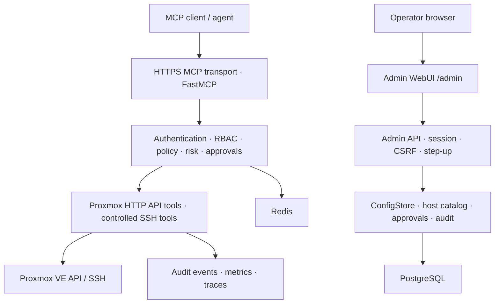
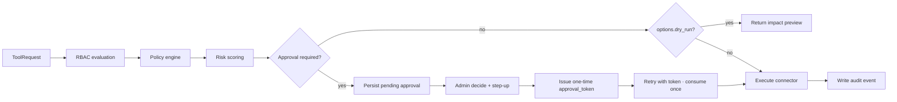

# Enterprise Proxmox MCP

[](https://github.com/0x696E7175696C696E65/Proxmox-MCP/actions/workflows/ci.yml)
[](https://github.com/0x696E7175696C696E65/Proxmox-MCP/actions/workflows/distribution.yml)
[](https://github.com/0x696E7175696C696E65/Proxmox-MCP/actions/workflows/hardening.yml)


Enterprise Proxmox MCP is a Model Context Protocol (MCP) server that exposes Proxmox VE administration to AI agents through a fail-closed control plane. Tool invocation is mediated by authentication, RBAC, policy evaluation, risk scoring, optional human approval, and durable audit recording. Operators administer the gateway via a bundled Admin WebUI (`/admin`), including multi-host catalog management, live configuration, and approval workflows.

<p align="center">
  
  <br />
  <em>Admin WebUI overview: readiness indicators, active Proxmox target, approval queue state, and recent audit activity (privacy mode enabled).</em>
</p>

This repository is an **actively developed, evidence-backed public preview**. It is suitable for homelab evaluation, disposable lab qualification, MSP assessment, and research. It is **not certified for unattended production control** of Proxmox clusters. Initial deployments should restrict agents to read-only tools, require dry-run and impact analysis for mutations, enforce approval for high- and critical-risk operations, and promote capabilities only after topology-specific evidence is collected.

## Capabilities

| Capability | Description |
|------------|-------------|
| **MCP tool registry** | Two hundred or more registered tools covering cluster, node, VM, LXC, storage, networking, firewall, backup, Ceph, HA, identity, helper-script, and SSH domains. Schemas and permissions are contract-tested against [`docs/tool-specification.md`](docs/tool-specification.md). |
| **Admin control plane** | React SPA served at `/admin`: overview, tool browser, audit stream, dependency health / doctor, approvals, host catalog, secrets, configuration, and runtime controls. |
| **Multi-host catalog** | Multiple Proxmox API endpoints may be registered; exactly one host is active. Activation rewrites cluster runtime configuration and executes a phased process restart with reconnect overlay. |
| **Approvals pipeline** | When policy requires approval, the guard mints a pending request (no token). An administrator performs step-up authentication, decides the request, and receives a one-time `approval_token`. The agent retries with that token; `consume()` enforces single use. |
| **Live policy binding** | Dangerous-operation and policy settings apply to the in-process `SecurityPlaneGuard` without restart where hot-apply is supported. Cluster endpoint and credential materialization that bind process-local clients mark `restart_required`. |
| **Authentication and authorization** | Service-token Bearer auth for MCP; Admin session cookies with CSRF protection. Primitives exist for OIDC (RS256/JWKS), mTLS client-certificate mapping, and signed workload identity. RBAC and deny-over-allow policy gate every non-internal tool. |
| **Step-up controls** | Password re-verification is required for approval decisions, secret mutation/reveal, policy changes that affect dangerous operations, and process restart. |
| **Audit and redaction** | SQLAlchemy-backed audit persistence with pre- and post-execution events. Sensitive keys are sanitized at the MCP security boundary; the WebUI privacy mode masks endpoints and credential-shaped fields for demonstration capture. |
| **Durable runtime** | PostgreSQL and Redis with TLS-enforced connection URLs, Alembic migrations, idempotency stores, Proxmox task tracking, circuit breakers, and SSH session/recording stores. |
| **Secret backends** | Development file store plus adapters for HashiCorp Vault KV v2, Bitwarden-style item fields, 1Password-style item fields, AWS Secrets Manager, and Azure Key Vault. |
| **Distribution and CI** | Docker/Compose homelab stack, operator CLI, distribution readiness (sdist/wheel/image), and hardening workflow including Trivy image scanning. |

### Recommended evaluation sequence

1. Restrict the agent to **read-only** discovery tools.
2. Exercise mutations with **`dry_run`** and inspect impact metadata before live execution.
3. Keep high- and critical-risk tools **approval-gated**.
4. Validate mutating paths against a **disposable Proxmox lab** before attaching production clusters.
5. Promote guarded tools only when promotion criteria and evidence are met ([`docs/tool-promotion-framework.md`](docs/tool-promotion-framework.md)).

## Admin WebUI

Screenshots were captured with privacy mode enabled (IP addresses and credential paths masked). Complete index: [`docs/screenshots/`](docs/screenshots/README.md).

<table>
  <tr>
    <td width="50%">
      
      <p align="center"><sub><b>Servers</b> — host catalog with probe, activate, and credential readiness</sub></p>
    </td>
    <td width="50%">
      
      <p align="center"><sub><b>Tools</b> — registered catalog with risk filters and constrained invoke</sub></p>
    </td>
  </tr>
  <tr>
    <td width="50%">
      
      <p align="center"><sub><b>Audit</b> — live stream of MCP tool and admin control-plane events</sub></p>
    </td>
    <td width="50%">
      
      <p align="center"><sub><b>Health</b> — dependency readiness matrix and doctor diagnostics</sub></p>
    </td>
  </tr>
  <tr>
    <td width="50%">
      
      <p align="center"><sub><b>Approvals</b> — dangerous-operation policy and pending decision queue</sub></p>
    </td>
    <td width="50%">
      
      <p align="center"><sub><b>Runtime</b> — process state, restart_required, and step-up restart</sub></p>
    </td>
  </tr>
</table>

## Architecture


```mermaid
flowchart TD
  agent["MCP client / agent"] --> mcp["HTTPS MCP transport · FastMCP"]
  operator["Operator browser"] --> webui["Admin WebUI /admin"]
  mcp --> guard["Authentication · RBAC · policy · risk · approvals"]
  webui --> adminApi["Admin API · session · CSRF · step-up"]
  guard --> tools["Proxmox HTTP API tools · controlled SSH tools"]
  adminApi --> stores["ConfigStore · host catalog · approvals · audit"]
  tools --> pve["Proxmox VE API / SSH"]
  stores --> pg["PostgreSQL"]
  guard --> redis["Redis"]
  tools --> observability["Audit events · metrics · traces"]
```

Mutating tool execution traverses authentication, RBAC, policy, risk/approval, and audit emission before any Proxmox API or SSH connector call.


```mermaid
flowchart LR
  req["ToolRequest"] --> rbac["RBAC evaluation"]
  rbac --> policy["Policy engine"]
  policy --> risk["Risk scoring"]
  risk --> need{"Approval required?"}
  need -->|yes| queue["Persist pending approval"]
  queue --> decide["Admin decide + step-up"]
  decide --> token["Issue one-time approval_token"]
  token --> retry["Retry with token · consume once"]
  need -->|no| dry{"options.dry_run?"}
  dry -->|yes| preview["Return impact preview"]
  dry -->|no| run["Execute connector"]
  retry --> run
  run --> audit["Write audit event"]
```

## Release status

`main` implements the MCP control plane, registered tool catalog, Admin WebUI, approvals and runtime pipelines, Compose/Kubernetes scaffolding, and an opt-in disposable lab harness. Claims beyond the tiers below remain evidence- and topology-gated.

| Qualification tier | Scope |
|--------------------|--------|
| **Preview validated** | Control plane; auth/RBAC/policy/approval/audit; read and safe-mutation paths; dangerous-operation guards; controlled SSH; durable state; current Proxmox VE 9.1.1 single-node storage lab profile |
| **Lab qualified** | Profile `pve-9-storage-local-local-lvm`: disposable VM lifecycle, backup create/list, restore-precondition dry-run, bounded storage benchmark preview, read-only node-update preflight |
| **Profile-gated** | Ceph, HA, multi-node, PBS verification, reusable LXC-template promotion, live storage expansion, live node-update orchestration |
| **Operator-qualified** | Production TLS material, external authentication, enterprise secret backend, least-privilege Proxmox credentials, and release evidence for the specific topology under management |

Unpromoted or backend-specific operations (for example `verify_backup`, unconstrained `expand_storage`, and live node-update orchestration) fail closed with `NOT_IMPLEMENTED` until promotion criteria are satisfied. See [`docs/domain-pack-status.md`](docs/domain-pack-status.md) and [`docs/proxmox-compatibility.md`](docs/proxmox-compatibility.md).

Required merge gates: Ruff format/lint, Pyright (strict, scoped), pytest, distribution readiness (sdist/wheel/image), hardening (Trivy), Alembic migration validation, and the security invariant suite.

## Quick start

### Homelab Compose stack

Deploys TLS termination for the MCP listener, PostgreSQL, Redis, service-token authentication, and file-backed Proxmox credentials. Procedure: [`docs/quickstart-homelab.md`](docs/quickstart-homelab.md).

```powershell
git clone https://github.com/0x696E7175696C696E65/Proxmox-MCP.git
cd Proxmox-MCP
powershell -ExecutionPolicy Bypass -File scripts/bootstrap-homelab.ps1
```

Configure `.env` and `secrets.local.json`, then:

```powershell
python -m pip install -e ".[dev]"
proxmox-mcp validate-config
proxmox-mcp doctor
docker compose -f docker-compose.yml -f docker-compose.homelab.yml up --build
```

```powershell
curl.exe -fk -H "Authorization: Bearer <service-token>" https://localhost:8443/health/ready
```

| Endpoint | Access |
|----------|--------|
| MCP | `https://localhost:8443` with `Authorization: Bearer <service-token>` |
| Admin WebUI | `https://localhost:8443/admin` (`PROXMOX_MCP_ADMIN_USERNAME` / `PROXMOX_MCP_ADMIN_PASSWORD`) |

Optional observability stack: Compose profile `observability`.

### Local development server

```powershell
python -m venv .venv
.\.venv\Scripts\Activate.ps1
python -m pip install -e ".[dev]"
python -m pytest -q
proxmox-mcp serve --mode dev
```

### Disposable lab validation

Opt-in Proxmox lab gates are documented in [`docs/lab-runbook.md`](docs/lab-runbook.md) and [`docs/testing-strategy.md`](docs/testing-strategy.md).

## Operator CLI

| Command | Description |
|---------|-------------|
| `proxmox-mcp serve --mode dev` | In-memory development runtime (durable state disabled) |
| `proxmox-mcp serve --mode homelab` | Durable PostgreSQL/Redis runtime with configured cluster |
| `proxmox-mcp validate-config` | Load settings and evaluate readiness validation rules |
| `proxmox-mcp doctor` | Probe PostgreSQL, Redis, and Proxmox API reachability |
| `proxmox-mcp migrate` | Apply Alembic migrations to the configured database |
| `proxmox-mcp tools list` | Enumerate registered tools (`--status live` \| `guarded`) |

## Configuration

Runtime configuration is environment-driven with prefix `PROXMOX_MCP_`. Templates: [`.env.example`](.env.example), [`secrets.local.json.example`](secrets.local.json.example).

Homelab minimum:

```powershell
$env:PROXMOX_MCP_ENVIRONMENT = "homelab"
$env:PROXMOX_MCP_DURABLE_STATE_ENABLED = "true"
$env:PROXMOX_MCP_AUTH_MODE = "service_token"
$env:PROXMOX_MCP_SERVICE_TOKEN = "<from-local-secret>"
$env:PROXMOX_MCP_SECRETS_FILE = ".\secrets.local.json"
$env:PROXMOX_MCP_CLUSTER__API_ENDPOINT = "https://pve.example.test:8006"
$env:PROXMOX_MCP_CLUSTER__CREDENTIAL_REF__PATH = "clusters/homelab/proxmox-api"
```

Transport policy is fail-closed: MCP ingress is HTTPS-only; Proxmox API endpoints must use `https://`; PostgreSQL URLs must request TLS; Redis must use `rediss://`. Secret-bearing settings are modeled with Pydantic `SecretStr` and redacted by security-boundary sanitization.

Production configuration (external auth, enterprise secret provider, pinned SSH host keys, approval policy, topology evidence): [`docs/deployment.md`](docs/deployment.md), [`docs/security-model.md`](docs/security-model.md).

## Technology stack

Python 3.13 · FastMCP · Pydantic v2 / pydantic-settings · SQLAlchemy asyncio / asyncpg · Redis · AsyncSSH · cryptography · structlog · Alembic · React Admin SPA · Docker / Compose / Kubernetes · Ruff · Pyright · pytest

## Documentation

| Document | Contents |
|----------|----------|
| [`docs/quickstart-homelab.md`](docs/quickstart-homelab.md) | Bootstrap, Compose, MCP client and Admin WebUI access |
| [`docs/screenshots/README.md`](docs/screenshots/README.md) | Admin WebUI screenshot index |
| [`docs/architecture.md`](docs/architecture.md) | Module boundaries and runtime composition |
| [`docs/security-model.md`](docs/security-model.md) | Authentication, authorization, policy, approvals |
| [`docs/threat-model.md`](docs/threat-model.md) | Assets, trust boundaries, abuse cases, mitigations |
| [`docs/tool-specification.md`](docs/tool-specification.md) | MCP tool catalog and permission metadata |
| [`docs/mcp-schema.md`](docs/mcp-schema.md) | Request, response, error, dry-run, and audit envelopes |
| [`docs/domain-pack-status.md`](docs/domain-pack-status.md) | Domain promotion status and guarded operations |
| [`docs/proxmox-compatibility.md`](docs/proxmox-compatibility.md) | Evidence-backed lab compatibility profiles |
| [`docs/deployment.md`](docs/deployment.md) | Docker, Kubernetes, HA, and operations |
| [`docs/release-hardening.md`](docs/release-hardening.md) | Release gates, chaos scenarios, known limitations |
| [`docs/roadmap.md`](docs/roadmap.md) | Implementation milestones |

## License

Licensed under the Apache License, Version 2.0. See [`LICENSE`](LICENSE).

## Production readiness

The project remains under active development. Before attaching the gateway to production Proxmox infrastructure:

- Execute the full test suite, distribution readiness, and hardening workflows, including the security invariant suite.
- Validate every enabled mutating or destructive tool against a disposable lab cluster.
- Leave unpromoted tools disabled until promotion evidence exists.
- Provision production-grade TLS, authentication, secret backends, PostgreSQL, and Redis.
- Review RBAC assignments, policy rules, approval requirements, and dangerous-operation settings for the target tenant model.
- Verify backup, rollback, and audit-retention procedures for the deployment.

Do not enable unattended live mutation or destruction until the corresponding tools have been verified in the specific environment under management.
