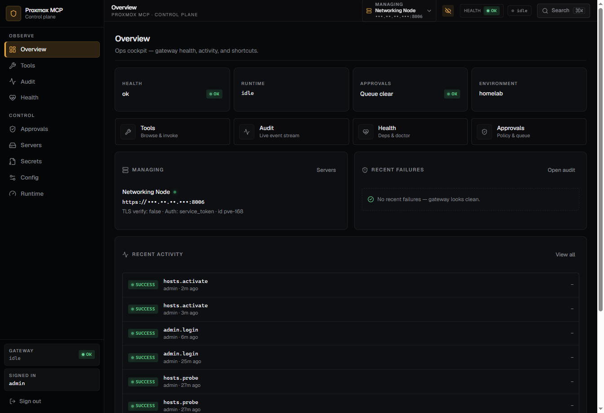
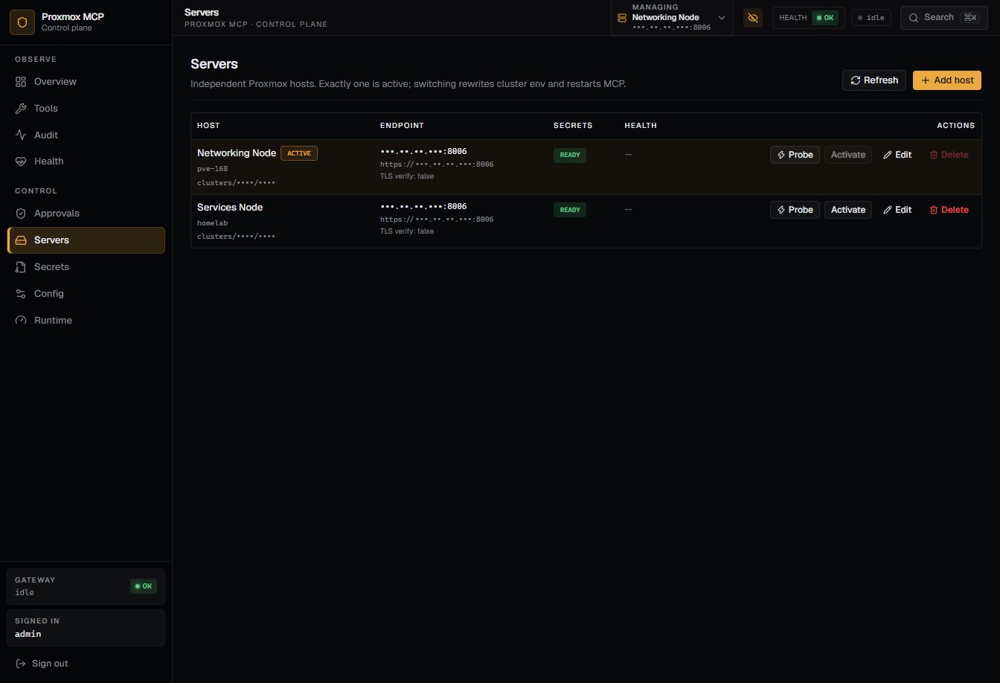
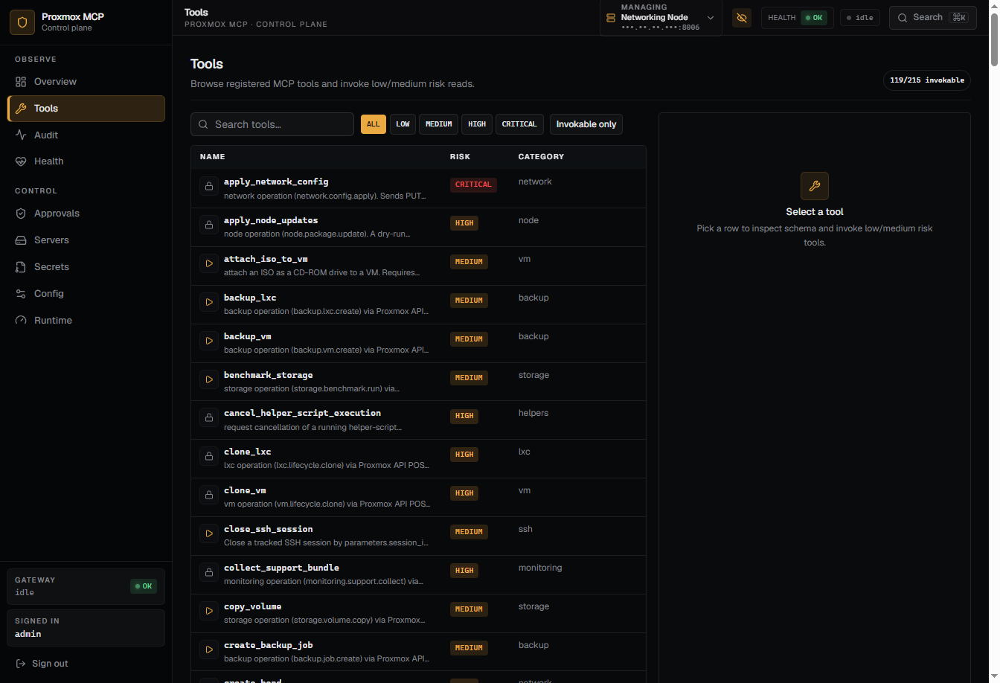
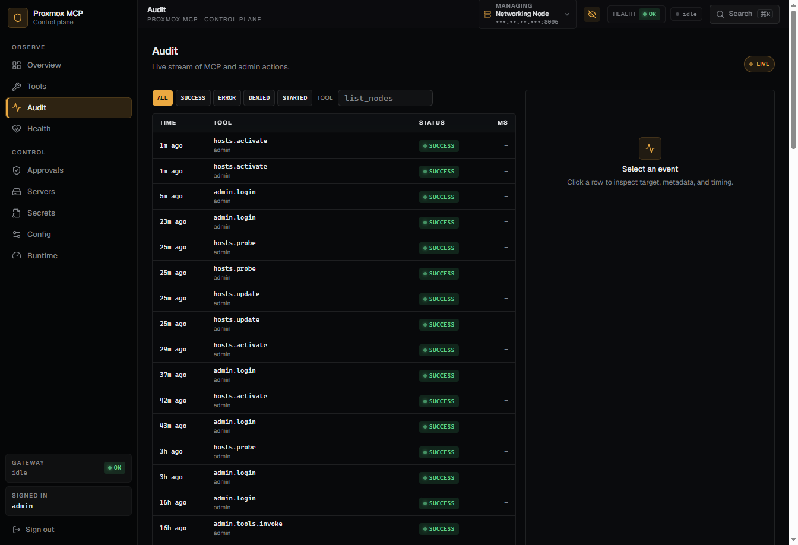
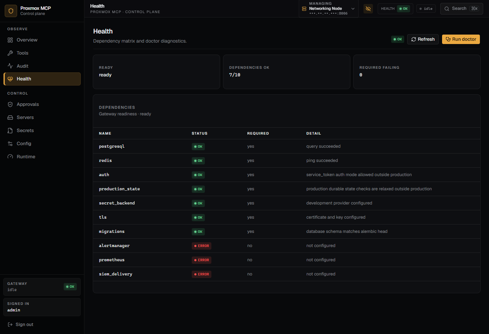
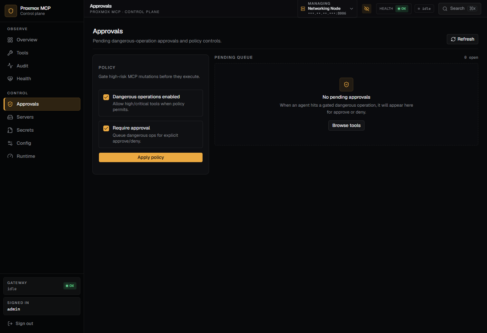
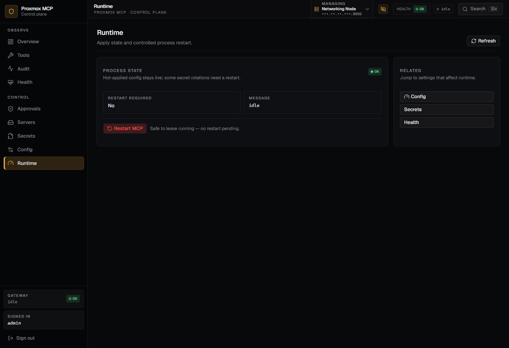
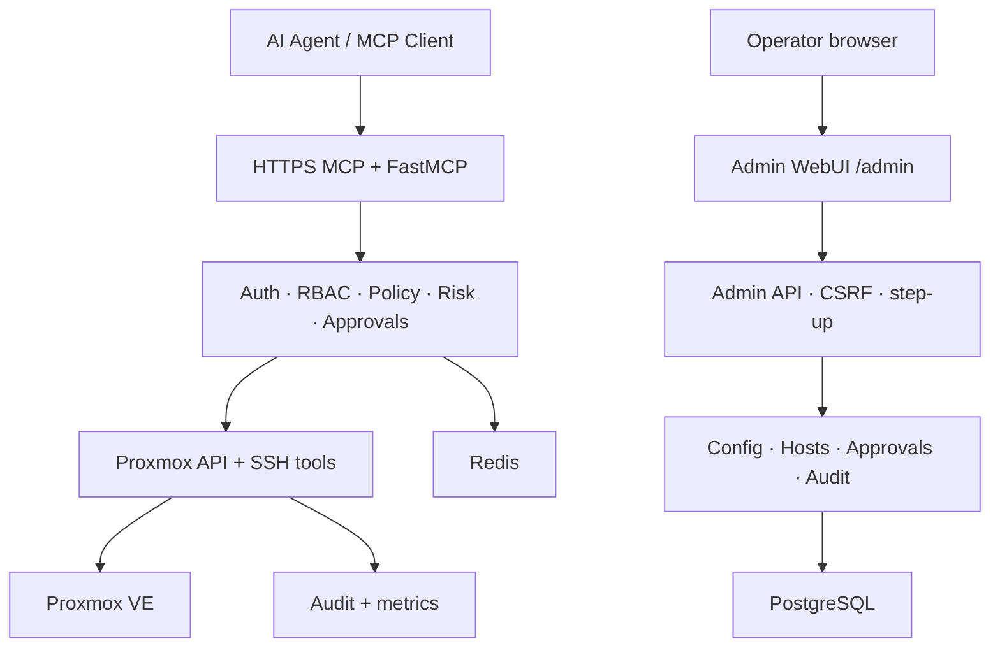
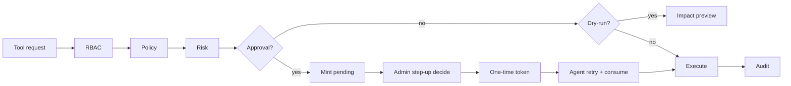

# Enterprise Proxmox MCP

[](https://github.com/0x696E7175696C696E65/Proxmox-MCP/actions/workflows/ci.yml)
[](https://github.com/0x696E7175696C696E65/Proxmox-MCP/actions/workflows/distribution.yml)
[](https://github.com/0x696E7175696C696E65/Proxmox-MCP/actions/workflows/hardening.yml)


**Security-first MCP server for AI-assisted Proxmox VE.** Agents get a controlled API + SSH tool surface; operators get an Admin WebUI with multi-host switch, live audit, health, and dangerous-op approvals.

<p align="center">
  
  <br />
  <em>Ops cockpit — gateway health, managing host, approvals status, and recent activity (privacy mode).</em>
</p>

Public preview for homelabs, lab validation, MSP evaluation, and research. Not certified unattended production control — start read-only, keep mutations dry-run / approval-gated, and qualify against your own topology.

## Features

| Area | What you get |
|------|----------------|
| **MCP tool catalog** | 200+ registered tools across cluster, nodes, VMs, LXC, storage, network, firewall, backup, Ceph, HA, users, helpers, and SSH — contract-tested against [`docs/tool-specification.md`](docs/tool-specification.md) |
| **Admin WebUI** | Bundled SPA at `/admin`: overview, tools browser, audit stream, health/doctor, approvals, servers, secrets, config, runtime |
| **Multi-host catalog** | Manage multiple Proxmox endpoints; one active host at a time with probe / activate and phased restart overlay |
| **Approvals pipeline** | Dangerous ops mint a pending request → admin step-up decide → one-time token → agent retry → single consume |
| **Live settings** | Hot-apply policy and dangerous-ops toggles into the running guard; cluster/secret changes clearly mark restart |
| **Fail-closed security** | AuthN (service token / OIDC / mTLS / workload identity primitives), RBAC, policy, risk scoring, CSRF + step-up on sensitive admin actions |
| **Audit & redaction** | Durable audit events, privacy mode in the UI, MCP/SSH output sanitization at the security boundary |
| **Durable runtime** | PostgreSQL + Redis (TLS-enforced URLs), Alembic migrations, idempotency, circuit breakers, SSH session/recording stores |
| **Secrets** | Development file store plus Vault, Bitwarden, 1Password, AWS Secrets Manager, and Azure Key Vault adapters |
| **Ship path** | Docker / Compose homelab stack, operator CLI, CI + distribution + hardening (Trivy) gates |

### Evaluate safely

1. Start with **read-only** discovery tools.
2. Prefer **dry-run** and impact previews before mutation.
3. Keep high/critical tools **approval-gated**.
4. Qualify on a **disposable lab** before real clusters.
5. Promote guarded tools only with matching evidence ([`docs/tool-promotion-framework.md`](docs/tool-promotion-framework.md)).

## Admin WebUI

Privacy-masked screenshots (IPs and credential paths censored). Full set: [`docs/screenshots/`](docs/screenshots/README.md).

<table>
  <tr>
    <td width="50%">
      
      <p align="center"><sub><b>Servers</b> — multi-host catalog; one active target</sub></p>
    </td>
    <td width="50%">
      
      <p align="center"><sub><b>Tools</b> — risk filters and low/medium invoke</sub></p>
    </td>
  </tr>
  <tr>
    <td width="50%">
      
      <p align="center"><sub><b>Audit</b> — live MCP and admin events</sub></p>
    </td>
    <td width="50%">
      
      <p align="center"><sub><b>Health</b> — dependency matrix + doctor</sub></p>
    </td>
  </tr>
  <tr>
    <td width="50%">
      
      <p align="center"><sub><b>Approvals</b> — policy + pending queue</sub></p>
    </td>
    <td width="50%">
      
      <p align="center"><sub><b>Runtime</b> — process state and step-up restart</sub></p>
    </td>
  </tr>
</table>

## How it works


```mermaid
flowchart TD
  agent["AI Agent / MCP Client"] --> mcp["HTTPS MCP + FastMCP"]
  admin["Operator browser"] --> webui["Admin WebUI /admin"]
  mcp --> guard["Auth · RBAC · Policy · Risk · Approvals"]
  webui --> adminApi["Admin API · CSRF · step-up"]
  guard --> tools["Proxmox API + SSH tools"]
  adminApi --> stores["Config · Hosts · Approvals · Audit"]
  tools --> pve["Proxmox VE"]
  stores --> pg["PostgreSQL"]
  guard --> redis["Redis"]
  tools --> audit["Audit + metrics"]
```

Every mutating tool call is expected to pass auth → RBAC → policy → risk/approval → audit before touching Proxmox or SSH.


```mermaid
flowchart LR
  req["Tool request"] --> rbac["RBAC"]
  rbac --> policy["Policy"]
  policy --> risk["Risk"]
  risk --> need{"Approval?"}
  need -->|yes| queue["Mint pending"]
  queue --> decide["Admin step-up decide"]
  decide --> token["One-time token"]
  token --> retry["Agent retry + consume"]
  need -->|no| dry{"Dry-run?"}
  dry -->|yes| preview["Impact preview"]
  dry -->|no| run["Execute"]
  retry --> run
  run --> audit["Audit"]
```

## Status

**Public preview** on `main`: control plane, tool catalog, Admin WebUI, approvals/runtime pipelines, Compose/K8s scaffolding, and disposable lab harness are implemented. Broader enterprise claims stay topology- and evidence-gated.

| Tier | Meaning |
|------|---------|
| **Preview validated** | MCP control plane, auth/RBAC/policy/approval/audit, read + safe mutate, dangerous-op guards, SSH, durable state, current PVE 9.1.1 single-node storage lab profile |
| **Lab qualified** | `pve-9-storage-local-local-lvm` disposable VM/backup/storage-benchmark/read-only update preflight evidence |
| **Profile-gated** | Ceph, HA, multi-node, PBS verify, reusable LXC-template promotion, live storage expansion, live node updates |
| **Operator-qualified** | Production TLS, external auth, enterprise secrets, least-privilege Proxmox creds, release evidence for *your* topology |

Guarded placeholders (`verify_backup`, broad `expand_storage`, live node-update orchestration, and similar) fail closed with `NOT_IMPLEMENTED` until promoted. Details: [`docs/domain-pack-status.md`](docs/domain-pack-status.md), [`docs/proxmox-compatibility.md`](docs/proxmox-compatibility.md).

Merge gates: Ruff, Pyright, pytest, distribution (sdist/wheel/image), hardening (Trivy), migration validation, security invariant suite.

## Quick start

### Homelab Compose (recommended)

TLS + PostgreSQL + Redis + service-token auth + file-backed Proxmox secrets. Full guide: [`docs/quickstart-homelab.md`](docs/quickstart-homelab.md).

```powershell
git clone https://github.com/0x696E7175696C696E65/Proxmox-MCP.git
cd Proxmox-MCP
powershell -ExecutionPolicy Bypass -File scripts/bootstrap-homelab.ps1
```

Edit `.env` and `secrets.local.json`, then:

```powershell
python -m pip install -e ".[dev]"
proxmox-mcp validate-config
proxmox-mcp doctor
docker compose -f docker-compose.yml -f docker-compose.homelab.yml up --build
```

```powershell
curl.exe -fk -H "Authorization: Bearer <service-token>" https://localhost:8443/health/ready
```

- **MCP:** `https://localhost:8443` with `Authorization: Bearer <service-token>`
- **Admin WebUI:** `https://localhost:8443/admin` (set `PROXMOX_MCP_ADMIN_USERNAME` / `PROXMOX_MCP_ADMIN_PASSWORD`)

Optional Grafana: add Compose profile `observability`.

### Dev server (no Compose)

```powershell
python -m venv .venv
.\.venv\Scripts\Activate.ps1
python -m pip install -e ".[dev]"
python -m pytest -q
proxmox-mcp serve --mode dev
```

### Lab gates

Opt-in disposable Proxmox validation — see [`docs/lab-runbook.md`](docs/lab-runbook.md) and [`docs/testing-strategy.md`](docs/testing-strategy.md).

## Operator CLI

| Command | Purpose |
|---------|---------|
| `proxmox-mcp serve --mode dev` | In-memory development server |
| `proxmox-mcp serve --mode homelab` | Durable Postgres/Redis + configured cluster |
| `proxmox-mcp validate-config` | Load settings and readiness rules |
| `proxmox-mcp doctor` | Probe PostgreSQL, Redis, and Proxmox API |
| `proxmox-mcp migrate` | Apply Alembic migrations |
| `proxmox-mcp tools list` | List tools (`--status live` / `guarded`) |

## Configuration

Settings use the `PROXMOX_MCP_` prefix. Start from [`.env.example`](.env.example) and [`secrets.local.json.example`](secrets.local.json.example).

Homelab essentials:

```powershell
$env:PROXMOX_MCP_ENVIRONMENT = "homelab"
$env:PROXMOX_MCP_DURABLE_STATE_ENABLED = "true"
$env:PROXMOX_MCP_AUTH_MODE = "service_token"
$env:PROXMOX_MCP_SERVICE_TOKEN = "<from-local-secret>"
$env:PROXMOX_MCP_SECRETS_FILE = ".\secrets.local.json"
$env:PROXMOX_MCP_CLUSTER__API_ENDPOINT = "https://pve.example.test:8006"
$env:PROXMOX_MCP_CLUSTER__CREDENTIAL_REF__PATH = "clusters/homelab/proxmox-api"
```

Transport is fail-closed: MCP is HTTPS-only; Proxmox endpoints must be `https://`; PostgreSQL must request TLS; Redis must use `rediss://`. Database/Redis/Vault URLs and secrets use Pydantic `SecretStr` and are redacted at security boundaries.

Production expectations (external auth, enterprise secret backend, pinned SSH hosts, approval policy, topology evidence): [`docs/deployment.md`](docs/deployment.md) and [`docs/security-model.md`](docs/security-model.md).

## Stack

Python 3.13 · FastMCP · Pydantic v2 · SQLAlchemy async / asyncpg · Redis · AsyncSSH · cryptography · structlog · Alembic · React Admin SPA · Docker / Compose / Kubernetes · Ruff · Pyright · pytest

## Documentation

| Doc | Topic |
|-----|--------|
| [`docs/quickstart-homelab.md`](docs/quickstart-homelab.md) | Bootstrap, Compose, MCP + Admin login |
| [`docs/screenshots/README.md`](docs/screenshots/README.md) | WebUI screenshot index |
| [`docs/architecture.md`](docs/architecture.md) | Module boundaries and runtime flows |
| [`docs/security-model.md`](docs/security-model.md) | AuthZ, policy, approvals, dangerous ops |
| [`docs/threat-model.md`](docs/threat-model.md) | Trust boundaries and mitigations |
| [`docs/tool-specification.md`](docs/tool-specification.md) | Full MCP tool catalog |
| [`docs/mcp-schema.md`](docs/mcp-schema.md) | Request / response / audit envelopes |
| [`docs/domain-pack-status.md`](docs/domain-pack-status.md) | Promotion status by domain |
| [`docs/proxmox-compatibility.md`](docs/proxmox-compatibility.md) | Evidence-backed lab profiles |
| [`docs/deployment.md`](docs/deployment.md) | Docker, Kubernetes, HA, ops |
| [`docs/release-hardening.md`](docs/release-hardening.md) | Release gates and known limits |
| [`docs/roadmap.md`](docs/roadmap.md) | Milestone roadmap |

## License

Apache License 2.0 — see [`LICENSE`](LICENSE).

## Production posture

Active development, evidence-backed preview. Before any production Proxmox attachment:

- Run CI/hardening and the security invariant suite.
- Validate every enabled mutating tool on a disposable lab.
- Keep unpromoted tools disabled.
- Configure real TLS, auth, secrets, PostgreSQL, and Redis.
- Review RBAC, policy, approvals, and dangerous-operation settings.
- Confirm backup, rollback, and audit recovery for your environment.

Do not enable unattended live mutation until those tools are verified in *your* topology.
