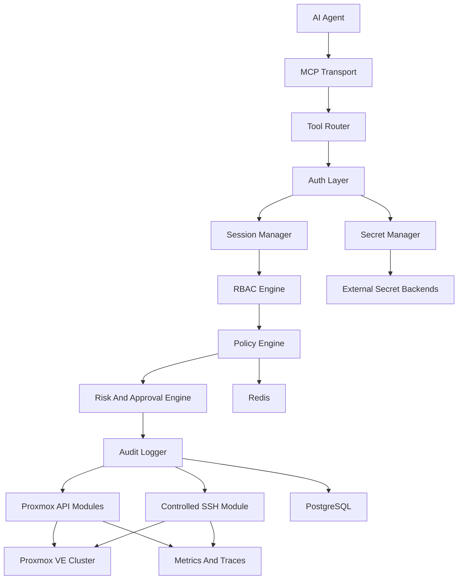

# Architecture

## Goals

Enterprise Proxmox MCP exposes Proxmox VE administration through MCP tools while ensuring that every action is authenticated, authorized, policy-evaluated, risk-scored, optionally approved, executed through a controlled connector, and fully audited.

The server must support both native Proxmox API operations and controlled SSH operations. API access is preferred for structured Proxmox resources. SSH is reserved for operations that are unavailable, incomplete, or operationally clearer through shell access.

## High-Level Design

## Runtime Request Flow

1. An AI agent calls an MCP tool with a structured request.
2. The transport validates MCP framing and assigns a correlation ID.
3. The tool router resolves the tool definition, expected permission, target resource, and risk profile.
4. The auth layer verifies agent identity, user context, and session state.
5. The RBAC engine checks coarse-grained role permissions and resource-scoped grants.
6. The policy engine evaluates allow, deny, and require-approval rules.
7. The risk engine calculates impact and determines whether dry-run, approval, or extra validation is required.
8. The audit logger records the decision before execution.
9. The selected module executes through Proxmox API or controlled SSH.
10. The audit logger records result, exit code, error detail, duration, and affected resources.
11. The server returns a structured MCP response with evidence, warnings, and rollback suggestions where applicable.

## Module Boundaries

### MCP Transport

The transport owns protocol compatibility with FastMCP. It should not contain Proxmox-specific business logic. Its responsibilities are request validation, response formatting, streaming events, tool registration, and correlation IDs.

### Tool Router

The tool router maps MCP tool names to capability handlers. Tool definitions include:

- Operation name and category.
- Required permission.
- Resource target resolver.
- Risk level.
- Dry-run support.
- Approval requirements.
- Idempotency behavior.
- Audit redaction rules.

### Auth Layer

The auth layer authenticates human users, service accounts, AI agent identities, and Proxmox credentials. It delegates secret retrieval to the secret manager and never stores raw secret values in logs or database tables.

### RBAC Engine

The RBAC engine resolves built-in and custom roles into permissions. Permissions are resource-scoped and can apply to datacenter, cluster, node, VM, LXC, storage, network, firewall, backup, Ceph, SSH, and user-management domains.

### Policy Engine

The policy engine provides deterministic authorization decisions after RBAC. Policies can allow, deny, or require approval for specific operations, resource patterns, tags, time windows, source agents, and environments.

### Risk And Approval Engine

The risk engine classifies operations as low, medium, high, or critical. It supports dangerous operations without hard-coding a permanent ban. Approval requirements are configurable and can include human approval, break-glass approval, multi-party approval, or automatic approval for lab environments.

### Audit Logging

Audit logging is append-oriented. Every decision and execution result is written as structured JSON and persisted to PostgreSQL. Optional sinks can forward events to Splunk, ELK, Graylog, Wazuh, Loki, or cloud logging backends.

### Proxmox API Modules

API modules use proxmoxer behind typed adapters. Each domain module owns request construction, response normalization, retry strategy, and resource mapping for its Proxmox domain.

Planned modules:

- Cluster
- Node
- VM
- LXC
- Storage
- Network
- Firewall
- Backup
- HA
- Ceph
- User and permission
- Monitoring

### Controlled SSH Module

The SSH module uses AsyncSSH and provides command execution, interactive shells, SFTP, SCP, upload, download, and session recording. It enforces command policy, timeout, rate limits, session limits, output capture, and audit redaction.

## Data Stores

### PostgreSQL

PostgreSQL is the system of record for users, agents, sessions, policies, approvals, audit events, tool invocations, credential references, SSH recordings, and discovered resources.

### Redis

Redis is used for short-lived coordination: session cache, rate limiting, idempotency keys, circuit breaker state, distributed locks, approval notifications, and API response cache entries.

### Secret Backends

Secret backends hold Proxmox API tokens, user/password credentials, SSH private keys, certificate material, and external service tokens. The application stores references and metadata, not raw secret values.

## Connector Strategy

API and SSH connectors share the same pre-execution pipeline. Handlers choose the connector based on:

- Whether Proxmox exposes a reliable API for the operation.
- Whether shell access is necessary for diagnostics, SMART data, package management, or advanced recovery.
- Whether the caller has SSH-specific permission.
- Whether policy permits shell execution for the target node.

## Reliability Model

- Retry transient API and SSH failures with bounded exponential backoff.
- Use circuit breakers per Proxmox node and API endpoint category.
- Reuse connection pools for Proxmox API clients and SSH sessions.
- Cache read-only discovery calls with short TTLs and explicit invalidation after writes.
- Fail closed for authorization, policy, secret retrieval, and audit persistence failures.
- Degrade gracefully for monitoring integrations and non-critical cache failures.

## Extension Points

The platform should allow new modules without changing the security pipeline. New tools register metadata, schemas, permission requirements, and handlers. The router supplies standard context objects for auth, policy, audit, secrets, Proxmox API, SSH, metrics, and cancellation.

## Non-Goals For Initial Implementation

- Replacing Proxmox VE itself as the system of record.
- Bypassing Proxmox permissions with hidden superuser behavior.
- Persisting raw secrets in application tables.
- Treating arbitrary shell execution as a safe default.
