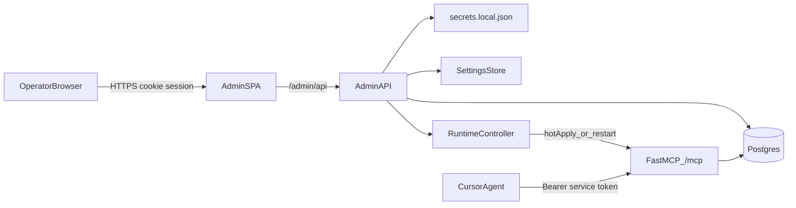

# MCP Admin Control Plane — Design

Date: 2026-09-20  
Status: approved for planning  
Scope: v1 MCP Control Plane only (not a Proxmox operations console)

## Summary

Build a co-located operator Web UI for Enterprise Proxmox MCP that provides live audit history, secure secrets/API configuration, runtime status, and config apply with hot-reload or explicit restart. The UI is a first-class improvement to the MCP gateway itself.

## Decisions

| Topic | Choice |
|-------|--------|
| Product scope | MCP Control Plane only |
| Auth | Local admin password now; `AdminIdentityProvider` for future OIDC |
| Architecture | Co-located Admin API + Vite/React SPA in the same container |
| Layout | Persistent sidebar + audit detail drawer |
| Realtime | SSE event stream; Postgres audit as source of truth |
| Service token | Agents only; never used as UI login |

## Goals

- View a detailed, timestamped history of every MCP tool action
- Configure Proxmox API credentials and MCP service token through a secure menu
- Edit non-secret runtime config with clear apply/restart semantics
- Feel premium, efficient, and operationally trustworthy — not a bolt-on dashboard

## Non-goals (v1)

- Proxmox VM/LXC management UI
- Multi-admin RBAC / multi-tenant admin console
- Full OIDC/SSO login (interface reserved only)
- Replacing Grafana/Prometheus observability

## Architecture

- Same HTTPS listener (`:8443`) as MCP
- Starlette mounts `/admin/api/*` beside existing `/mcp`, `/health/*`, `/metrics`
- Static SPA served at `/admin` from built `web/dist`
- Module boundary: `proxmox_mcp.admin` owns HTTP routes, auth, config store, runtime control; does not embed Proxmox tool logic

## UI surfaces

1. **Overview** — health, mode, masked endpoint, recent failures, restart state  
2. **Audit** — live event list + detail drawer (time, actor, tool, target, status, duration, redacted metadata)  
3. **Secrets** — Proxmox API token + service token rotation; reveal-on-demand; last-4 masks  
4. **Config** — cluster endpoint, TLS verify, log level, dangerous-ops flags, actor labels  
5. **Runtime** — apply status, last reload, restart-required banner, manual restart  

Layout: persistent left sidebar, main content, audit detail as right drawer.

Visual direction: calm ops-console density (not marketing), strong typography, restrained color for status only, no generic “AI dashboard” chrome.

## Data flow

1. MCP tool execution already writes `AuditEvent` via existing audit writer into `audit_events`.
2. Admin SPA subscribes to `GET /admin/api/events` (SSE) for `audit.created`, `runtime.*`, `health.tick`.
3. Audit list/detail reads through extended `AuditEventRepository` (filters, cursor pagination).
4. Config/secrets mutations go through `ConfigStore`: validate → redact → persist → audit `admin.*` event → `RuntimeController.apply()`.
5. **Hot-apply:** log level, cluster endpoint/TLS verify (rebuild Proxmox client), actor labels.  
6. **Restart required:** service token, TLS material paths, database/redis URLs, auth mode. UI shows banner; restart is operator-confirmed.
7. Restart uses graceful process exit so Docker Compose `restart: unless-stopped` (or equivalent) brings the container back; UI waits on `/health/ready`.

## Security

- Bootstrap admin from `PROXMOX_MCP_ADMIN_USERNAME` / `PROXMOX_MCP_ADMIN_PASSWORD` on first boot; store Argon2id hash in Postgres; do not keep plaintext password in process settings after bootstrap
- Session cookie: HttpOnly, Secure, SameSite=Lax; idle timeout ~8h; rotating session id
- `AdminIdentityProvider` protocol with `LocalPasswordProvider` implementation; OIDC later without UI rewrite
- CSRF protection on mutating admin routes (Origin check + session-bound token)
- Rate-limit login and secret reveal
- Secrets never appear in logs, audit metadata, or list API payloads (masks + last-4 only)
- Separation: MCP Bearer cannot access `/admin/api/*`; admin session cannot invoke `/mcp` tools
- Single admin role in v1

## Error handling

- Invalid writes → HTTP 422 with field errors; no partial apply
- Hot-apply failure → keep last-good disk config; revert in-memory client; surface error in Runtime + audit
- Restart failure → failed state in UI; health endpoints remain source of truth
- SSE disconnect → client reconnect with backoff; list endpoint remains authoritative

## Key API sketch

| Method | Path | Purpose |
|--------|------|---------|
| POST | `/admin/api/auth/login` | Local admin login |
| POST | `/admin/api/auth/logout` | End session |
| GET | `/admin/api/me` | Current admin identity |
| GET | `/admin/api/overview` | Health + status summary |
| GET | `/admin/api/audit` | Filtered audit page |
| GET | `/admin/api/audit/{id}` | Event detail |
| GET | `/admin/api/events` | SSE stream |
| GET/PUT | `/admin/api/config` | Non-secret settings |
| GET/PUT | `/admin/api/secrets` | Masked secrets; PUT rotates |
| POST | `/admin/api/secrets/reveal` | Step-up reveal (audited) |
| GET | `/admin/api/runtime` | Apply/restart state |
| POST | `/admin/api/runtime/restart` | Confirmed restart |

## Persistence additions

- `admin_users` — id, username, password_hash, created_at, last_login_at  
- `admin_sessions` — id, user_id, expires_at, created_at, revoked_at  
- Reuse `audit_events` for both MCP tool audit and `admin.*` control-plane events  
- Extend audit repository query: time range, tool_name, result_status, actor, cursor

## Integration points (existing code)

- Mount admin routes near `_register_http_routes` in [`src/proxmox_mcp/server/app.py`](src/proxmox_mcp/server/app.py)
- Wire bundle deps from [`src/proxmox_mcp/server/runtime.py`](src/proxmox_mcp/server/runtime.py)
- Audit models: [`src/proxmox_mcp/audit/events.py`](src/proxmox_mcp/audit/events.py), [`src/proxmox_mcp/audit/repository.py`](src/proxmox_mcp/audit/repository.py)
- Settings: [`src/proxmox_mcp/config.py`](src/proxmox_mcp/config.py)
- Secrets file pattern: `secrets.local.json` + development provider
- Homelab compose: [`docker-compose.yml`](docker-compose.yml), [`docker-compose.homelab.yml`](docker-compose.homelab.yml), [`Dockerfile`](Dockerfile)

## Testing

- Backend: auth, CSRF, token isolation, audit filters/SSE, ConfigStore classification, secret redaction, restart controller mocks
- Frontend: audit list/drawer, masked fields, restart banner states
- Playwright smoke: login → audit → hot-apply config → applied status
- Existing MCP pytest suite remains green

## Rollout

1. Backend admin auth + audit API + SSE  
2. Config/secrets store + runtime controller  
3. SPA shell (sidebar) + Overview/Audit  
4. Secrets/Config/Runtime pages  
5. Docker build wiring + `.env.example` admin bootstrap  
6. Tests + docs (`docs/quickstart-homelab.md` admin section)

## Out of scope follow-ups

- OIDC admin login  
- Proxmox inventory/ops pages  
- Multi-user admin RBAC  
- External secret backend management UI (Vault/1Password)
