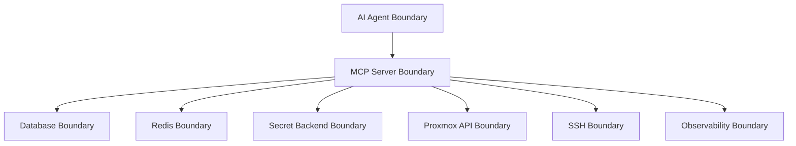

# Threat Model

## Scope

This threat model covers the MCP server, its data stores, its secret integrations, Proxmox API access, SSH access, observability sinks, and the AI agents that call MCP tools.

## Assets

- Proxmox cluster availability and integrity.
- VM and LXC workloads.
- Storage pools, datastores, backup chains, and snapshots.
- Network configuration and firewall policy.
- Ceph cluster data and metadata.
- Proxmox user accounts, API tokens, and permissions.
- SSH keys and session recordings.
- MCP caller credentials and AI agent identities.
- Audit logs and approval records.
- Policy definitions and RBAC assignments.

## Trust Boundaries

Critical trust boundaries:

- AI agent to MCP server.
- MCP server to secret manager.
- MCP server to Proxmox API.
- MCP server to SSH endpoint.
- MCP server to SIEM and logging systems.
- Operator approval UI or API to approval store.

## Threat Actors

- Compromised AI agent.
- Malicious or careless authenticated user.
- External attacker with stolen MCP token.
- Insider with excessive Proxmox privileges.
- Compromised secret backend token.
- Compromised logging or observability sink.
- Network attacker between the MCP server and Proxmox infrastructure.
- Supply-chain attacker targeting dependencies or container images.

## Abuse Cases And Mitigations

### Unauthorized Destructive Operation

An attacker attempts to destroy VMs, delete storage, remove Ceph OSDs, or shut down nodes.

Mitigations:

- RBAC resource scopes.
- Explicit deny policies.
- Dangerous operation classification.
- Approval workflows.
- Impact analysis and target revalidation.
- Append-only audit logs.
- Idempotency and replay protection.

### Prompt Injection Causes Harmful Tool Use

An AI agent is manipulated into calling destructive or unauthorized tools.

Mitigations:

- Server-side policy enforcement independent of agent instructions.
- Dry-run defaults for high-risk operations.
- Mandatory approval policies.
- Risk scoring in tool responses.
- Operation-specific permissions.

### Secret Exfiltration

An attacker tries to expose API tokens, passwords, SSH keys, or secret backend credentials.

Mitigations:

- Store only secret references in PostgreSQL.
- Redact tool inputs, command output, logs, and errors.
- Restrict secret read capability to connector code.
- Avoid MCP tools that return raw secret material.
- Use backend audit logs and rotation metadata.

### SSH Command Abuse

An authorized caller uses SSH to bypass structured Proxmox permissions.

Mitigations:

- Separate SSH permissions from Proxmox API permissions.
- Command policy checks.
- Session recording.
- Timeout and rate limiting.
- Per-node and per-command approval requirements.
- No implicit shell access for administrative roles.

### Audit Log Tampering

An attacker attempts to hide actions or alter results.

Mitigations:

- Write pre-execution and post-execution audit events.
- Use append-oriented audit tables.
- Forward logs to external SIEM.
- Include correlation IDs and hash-chain fields for optional tamper evidence.
- Fail closed if required audit persistence fails.

### Confused Deputy Across Tenants

An AI agent or user operates on resources outside the intended tenant or customer.

Mitigations:

- Tenant-aware resource scopes.
- Policy conditions on tenant, resource pool, tags, node, and VM ID ranges.
- Separate credentials per tenant or environment.
- Audit fields for tenant and environment.

### Dependency Or Image Compromise

A dependency, base image, or build pipeline introduces malicious code.

Mitigations:

- Pin dependencies with lock files.
- Run dependency vulnerability scanning.
- Generate SBOMs.
- Sign container images.
- Use minimal runtime images.
- Enforce CI checks before release.

### Denial Of Service

An agent or attacker issues expensive discovery calls, many SSH sessions, or repeated retries.

Mitigations:

- Per-agent and per-user rate limits.
- Concurrent SSH session limits.
- Circuit breakers.
- Bounded retries.
- API response caching.
- Backpressure on streaming outputs.

### Approval Replay

An attacker reuses an approval for a different target or after expiration.

Mitigations:

- Bind approvals to actor, operation, target, input hash, risk score, and expiration.
- Require replay-protection tokens.
- Revalidate target state immediately before execution.

## Security Invariants

- No tool execution happens without an authenticated actor.
- No operation executes without RBAC and policy decisions.
- Deny policies override all other policy outcomes.
- Dangerous operation behavior is configurable but always auditable.
- Secrets are never hardcoded and never returned through MCP tools.
- SSH access is never implied by Proxmox API access.
- Audit persistence failure prevents execution for mutating actions.

## Residual Risks

- A fully privileged ClusterAdmin with approved access can still perform destructive actions.
- Proxmox API behavior may differ across versions and require compatibility testing.
- Some shell commands cannot be perfectly impact-analyzed before execution.
- External SIEM compromise can affect downstream investigations, though primary audit storage remains authoritative.
- Hardware-backed SSH key support depends on the deployed signing and agent environment.
